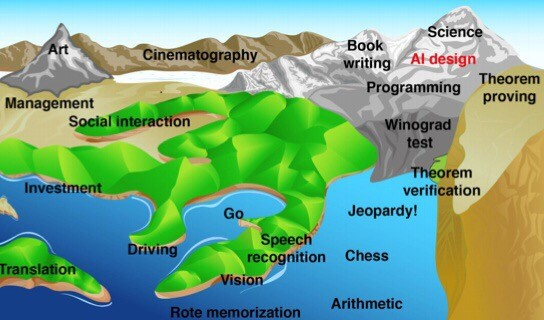

# Machine Learning Meta Book

This is not a stand-alone book but rather a collection of extensive references, specifically designed for senior machine learning researchers.
It does not include many implementation details and instead focuses more on mathematical foundations.

This is a highly advanced book that strives to be as deep as possible, but it does so at the expense of details, implementation methods, and breadth of subtopics within subfields.

## Subjects

- (ML) Traditional Machine Learning Theories
- (DL) Deep Learning and Neural Network Basics
- (CV) Computer Vision Fundamentals
- (NLP) Natural Language Processing Basics
- (RL) Reinforcement Learning
- (RE) Recommendation Systems
- Advanced Deep Learning
    - Semi-supervised Learning
    - Self-supervised Learning
    - Contrastive Learning
    - Active Learning
    - Continuous Learning
    - Architecture Search
    - Loss Function Theories
- Transformers
- Multi-modal Techniques
- AI simulation
- (LLM) Large Language Models
  - Theory
  - Prompt engineering
  - RAG
- (GenAI) Generative AI
    - Image Generation
    - Chatbots
    - Multi-modal cross application
- AI Agents
- (EAI) Embodied Intelligence

## Application
Nowadays, the application of AI nearly covers everything, but we still can trying to list
all its ablities.

### Modality
One way is categorized them by modalities of input/output:
- text to text
    - natural chat
    - text-based/code-based tasks (almost cover everything, but the intelligence level is limited)
    - text to diagram: flow chart, mind map
- image to image: coloring, segementation
- text to image
- image to text
  - image to structured data

### Major/Discipline
Another way is categorized them by human-defined field:

