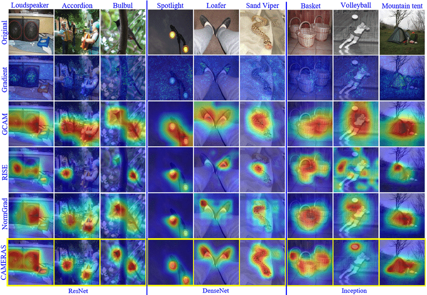

# CNN

references: https://onedrive.live.com/edit.aspx?resid=BEF76BD482A6B496!16288&migratedtospo=true&wd=target%28%E8%AE%A1%E7%AE%97%E6%9C%BA%E8%A7%86%E8%A7%89.one%7Ce62dec13-74a6-4848-8bf4-bcd47aeaba78%2FCNN%7Ce57fbe94-affa-4e39-a598-6513b45faf87%2F%29&wdorigin=NavigationUrl

---

Convolutional Neural Networks (CNNs) are designed primarily for processing structured grid data like images. 

## CNN structure

CNN works primarily by its **convolution operation** in its **convolution layer**.

Convolution operation: In a convolutional layer, 
filters **slide** over the image spatially performing a **convolution operation**(i.e. elementwise multiplication and sum) to produce a **feature map** 
that highlights the presence of specific morphological features.

After several convolutional layers, 
the deep feature maps are flattened to be further processed in the neural work to perform tasks like classification.

## CNN interpretablity

### Feature Visualization

Goal: visualize the morphology which activates the neurons of the model.

#### Deconv visualization

In this method, we keep only the selected neuron active,
and feed it back to construct the input component which contributed the activation of the selected neuron.

Since the feature map is aligned different conv filters, we could visualize the target morphology pattern of each filter.

#### Activation Maximization

reference: https://www.researchgate.net/publication/265022827_Visualizing_Higher-Layer_Features_of_a_Deep_Network

Similar to Deconv visualization, but use gradient to create artificial inputs.

This technique helps interpret what specific neurons in the network respond to by generating an input that produces the highest activation for a chosen neuron.

### Saliency Map

Goal: get a heatmap over input image to highlight the region where influence the model output most.

#### Mask-based

**Occlusion Sensitivity**: Mask different parts of the input image and observe model output change.

**RISE (Randomized Input Sampling for Explanation)**: Randomly mask different parts of the input image,
statistically compute the influence of each parts.

#### Gradient-based

**Vanilla Saliency Map**: directly calculate the target gradient respective to input pixel.

**Grad-CAM**: the calculated target gradient respective to last feature map pixel is used as saliency coefficients of that 
feature channel. The aggragated feature map is directly used as saliency map.

**SmoothGrad**: add noise to the input image to smooth the Grad-CAM.

# 1D CNN
- TCN
- WaveNet (see `./wavenet.md`)

