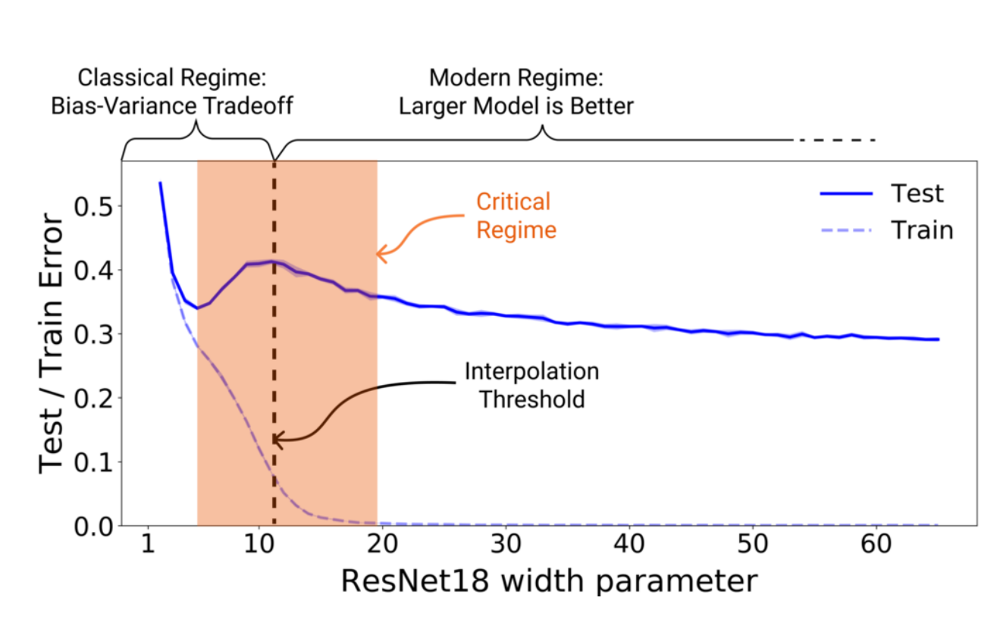

# Regularization

Reference: 
- https://onedrive.live.com/edit.aspx?resid=BEF76BD482A6B496!16288&migratedtospo=true&wd=target%28%E6%B7%B1%E5%BA%A6%E5%AD%A6%E4%B9%A0.one%7C4ab3a169-69c4-42b8-b4ff-6611a9ee8a28%2F%E6%A8%A1%E5%9E%8B%E6%AD%A3%E5%88%99%E5%8C%96%7Ca138db2e-df10-495a-b840-ceb38ea5af64%2F%29&wdorigin=NavigationUrl

About overfitting:
Overfitting is model overly fits to the training data and lost its generalizibility. 

(However, in large DL model, we also see double descent phenomenon of test error:

)

Clues:
- Prevent overfitting directly (DataAug, EarlyStopping)
- Normalize data/weights (batchNorm, LayerNorm)
- Add regularization term (penalty term to loss, such as L1, L2)
- Decrease model capacity (dropout, distillation)
- Adapt model Ensembling

## Data Augmentation
- Noise
- Adversarial

## Model Normalization

- **BatchNorm**: Every feature is normalized independently across a batch.
- **LayerNorm**: Every feature of a single layer with a single input is normalized across each other.
- **InstanceNorm**: (Similar to LayerNorm) Every feature of a single layer with a single input is normalized across each other within one channel.
- **GroupNorm**: Grouped instanceNorm, ie. some channels are grouped.

### BatchNorm

Points:
- There is a trainable re-scaling step. 
- In the inferencing stage of a BatchNorm, the moving average during training is used, instead of the inferencing batch.
- Obviously, BatchNorm is not suitable for sequential input, where number of tokens is not stable. 

### LayerNorm
Functions:
- Control the scale of gradient, prevent exploding or vanishing.
- Average feature effect to gain generalization.
- Normalizaiton is optimizer friendly.

### Dropout

Randomly deactivate a fraction of neurons of a layer whenever tensor pass forward during the training phase.

Function, explanation from three perspectives:
- **Regularization**: create noise, similar to add a regularization term. Prevent overfitting. 
- **Feature robustness**: It prevents the network from becoming overly reliant on specific neurons.
- **Ensemble effect**: similar to traing a bunch of different models and ensemble them. 

## Penalty
- L1
- L2
- l1 & L2 (Elastic)

## Ensemble methods
- bagging
- boosting
- stacking

## Label smoothing

Instead of using hard, one-hot encoded labels (e.g., `[0, 1, 0]`), it creates "soft" labels by distributing a small amount of the probability mass from the correct class to the other classes. 

For example, for a 3-class problem with a hard label `[0, 1, 0]` and a smoothing factor `ε = 0.1`, the new soft label is calculated as:

$$
y_{smooth} = (1 - ε) * y_{hard} + ε / C
$$

> [0, 1, 0] -> [0.0333, 0.9333, 0.0333]

