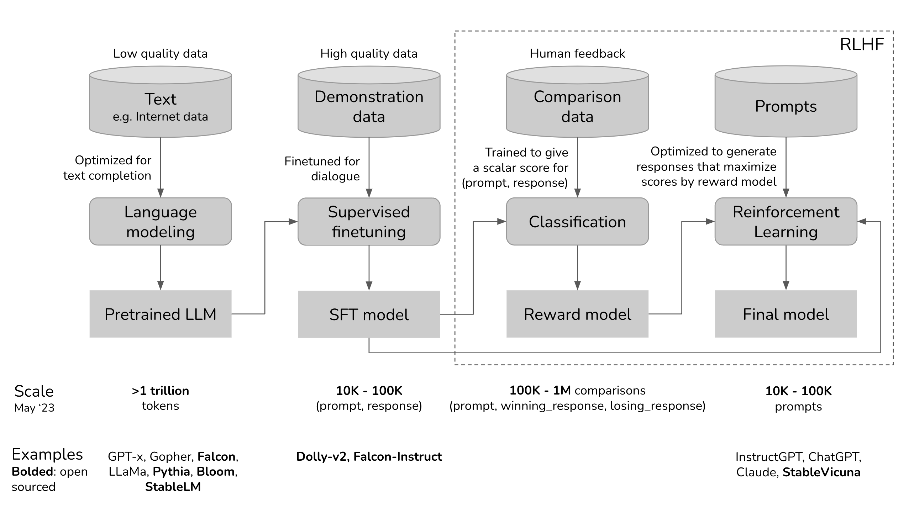

# How to build chatGPT

reference: https://huyenchip.com/2023/05/02/rlhf.html

There are three steps to build chatGPT:
- Pretrain LLM.
- Finetune a SFT for dialog.
- RLHF.

## Details of pretraining and finetuning

## RLHF (Reinforcement Learning from Human Feedback)
It is the 3rd step where a Reward Model(RM) is trained and it is used to further finetune the SFT through Proximal Policy Optimization (PPO).

### How to train a RM

After we get a bunch of preference pairs (A, B), meaning A is more preferable over B. 
We can define the loss as following:

$$
L = -\log\left(\frac{\exp(R(A)) + \exp(R(B))}{\exp(R(A))}\right)
$$

### How to use PPO to finetune the SFT

refer `rl/PPO.md` for the introduction of PPO.

PPO can be regarded as a simple variation of Policy Gradient (PG). In PG, we need know current reward of the state $r_t$ after $a_t$,
and policy function $\pi_{\theta}(a_t \| s_t)$, they are replaced by RM and Language model:

| In PG | In ChatGPT |
|----------|----------|
| $r_t$  | $RM(s_t, a_t)$  |
| $\pi_{\theta}(a_t \| s_t)$ | $\prod_{i=1}^n P_\theta(w_i \mid w_{<i}, s_t)$ |

Note that, the $V_{\phi}(s)$ is finetuned from the SFT drived from previous steps.

