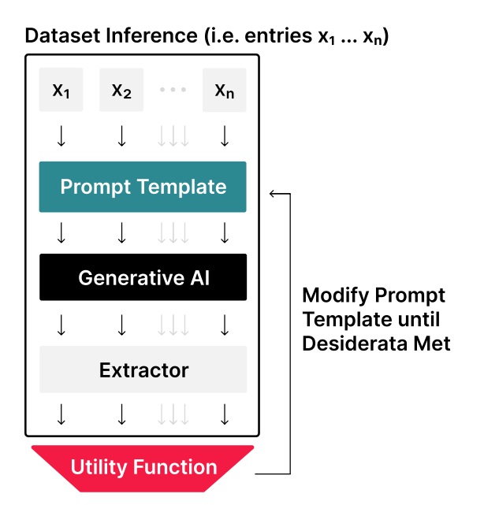
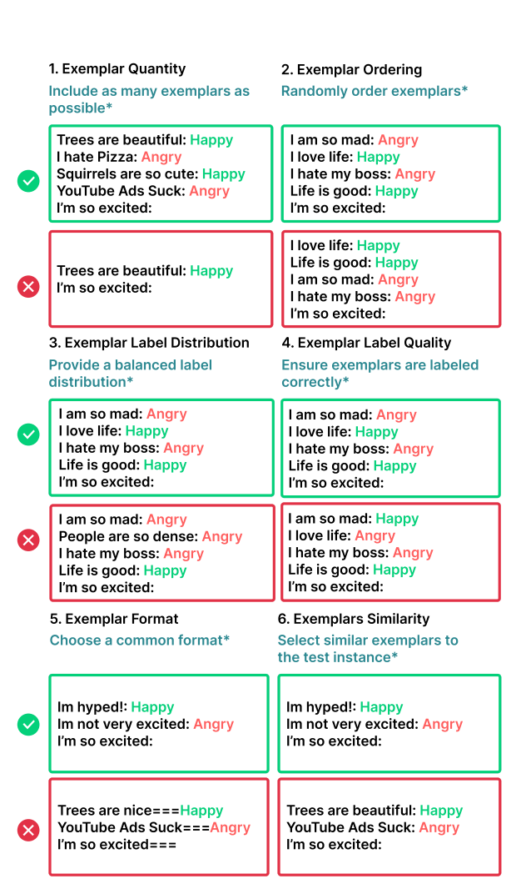

# The prompt report

## Terminology

- Components of a prompt
  - Role
  - Directive: direct question or instruction. can be explicit or implicit (one-shot in-context)
  - Additional information for the directive
  - Output formating
    - Style instructions
  - Exemplar

Prompting Terms
- Prompting: providing information to GenAI
- Prompt Chain: output of GenAI as parameter to next prompt
- Prompting Technique (**PT**): Guidelines to create Prompt or Prompt chain; A prompting technique may incorporate conditional or branching logic, parallelism, or other architectural considerations spanning multiple prompts.
- Prompt Engineering: process of developing PT.
- Prompt Engineering technique: automatic prompt engineering.

## Prompting Technique (PT)

### In-context Learning (ICL)
Providing them with exemplars and or relevant instructions within the prompt.
- (zero-shot) Fine-tuned task instructions
- few-shots prompting

#### Zero-shot prompt technique (PT)
- Assign role
- Define style
- Emotion prompting: add psychological relevance to human to control the behavior to LLM.
  - “It is very important for me to ..”
  - “My grandma is dying”-
- S2A, RaR, MetaPrompt: self-PT
  - RE-2 (just repeat the question again)
- Active prompting: Self-Ask

#### Few-shot prompt technique (PT)

#### Few-shot prompt engineering technique
- Few-shot Prompt mining: find best words to phrase exemplars
- Few-shot Prompt generation: Manage a pool of supervised data, select few samples as exemplars in the few-shot prompt. 
  - Search/Human-in-loop/self-generate
- Active Prompting: based on model uncertainty to create supervised data

### Thought Generation

#### Zero-shot CoT
- Thought inducer (Magical phrases, that are short and universal)
  - "Let’s think step by step."
  - "First, let’s think about this logically"
  - "Let’s work this out in a step by step way to be sure we have the right answer"
  - “Walk me through this context in manageable parts step by step, summarizing and analyzing as we go.”
- Step-back prompting: ask a high-level question first.
- Analogical prompting: ask to generate some exemplars with CoT first.
- Thoughts management tool: use markdown. 

#### Few-shot CoT
- Contrastive: show how-not to reason
- Complexity-based: use more complex exemplars
- Memory-of-thought: use self-generated similar exemplars. Compare to Analogical prompting, it has a retrievingprocess to get similar exemplars. 

#### Decomposition
Decomposing complex problems into simpler sub-questions.

- Decomposition inducer
  - “Let’s first understand the problem and devise a plan to solve it. Then, let’s carry out the plan and solve the problem step by step” (Plan-and-solve)
- chain-based
  - Least-to-Most prompting
  - Skeleton-of-Thought: parallel sub-workers
- Program-of-Thoughts: encourage symbolic thinking and programming solving
- Based on human cognitive knowledge
  - Metacognitive Prompting

#### Self-Criticism
- Self-Calibration
- Self-Refine: multiple steps of Self-Criticism

#### Other node-based thinking protocal
- Tree of thoughts
- Graph of thoughts

They can be just single zero-shot thinking protocol, or a a chain of in-context prompting “game”.

### Ensembling
Aggregate answers of multiple runs

- Self-consistency (majority). → Universal - Self-consistencyTree-of-thought (evolution)- Multi-lingual 

## Prompt Engineering Technique

- Trainable:
  - AutoPrompt
  - RLPrompt
  - Textual: Universal and transferable adversarial attacks on Aligned Language Models
- Textual (soft-optimization) - Heuristic algorithm
  - Automatic Prompt Engineer (APE). 
  - Gradientfree Instructional Prompt Search (GrIPS) → Evolutional algorithm on prompts

## Major prompting scenario

### AI Evaluator

- Model-generate guidelines
  - AutoCalibrate (Human guidelines -> set of model-refined guidelines)

#### output format
- (xml or json-style improves performance)
- Scale
  - Binary
  - Linear
  - Likert

### Agents

Agents are LLMs which using tools. To use tools, there are three engineering pattern:
- Single tool: An executor read LLMs output, parse it and execute it as API calls of the tool.
- Multiple tools: An router read LLMs output and decide which tool to interact with and invoke the executor of that tool with some raw text input.
- Multiple tools (Router-heavy): An router read LLMs output and decide which tool to interact with and direct execute API calls to that tool. 

(PS. If the tool itself is a server, ie. active tool, and accept API calls, then the agent should be NOT be defined as router-heavy, although it looks like direct execute.)

- RAG. The tool is a library manager.
- Observation-based. Prompt chain with the feedback of the environment.
- Life-long learning agents. Includes self-goal, and maintain a knowledge-base to retrieval information.

### Multi-modual

Chain of image
 
### Beyond English

First of all, english in general has the best performance. 

## Prompting Issues

### Security

Prompt attacks can lead to:
- Information leak
  - training data
  - knowledge base data
  - system prompts
- Malicious generation
  - offensive content
  - deceptive information
- High risk generation
  - Code bug
    - Package hallucination
  - Customer mis-instructions

#### Jailbreaking

Erase the intention of the service based on LLM by certain prompt. Such as "Ignore previous instructions and ...".

Mostly due to LLM can not distinguish between (pre-defined) developer instructions (as pre-text prompt) and user instructions.

#### Prompt injection

The malicious prompt not **directly** comes from user prompt. For example, maybe in the RAG system, in a prepared text website. 

#### Solutions

- (Input) Detector
- Prompt-based
- (Output) Validator

### Sensitivity

Small changes in the prompt and task rephrasing can change the performance of LLM.

### Over-confidency
LLMs are often overconfident in their answers, especially when prompted to express their own confidence in words.

### Sycophancy
A deeper systematic flaw rather than just sounds sycophancy. It will actually try to align with user satisfactory instead of sticking to 'truth'.

### Biases, Stereotypes, and Culture
LLMs should be fair to all users, such that no bi-ases, stereotypes, or cultural harms are perpetuated in model outputs.

### Deal with Ambiguity

Prompting techniques

